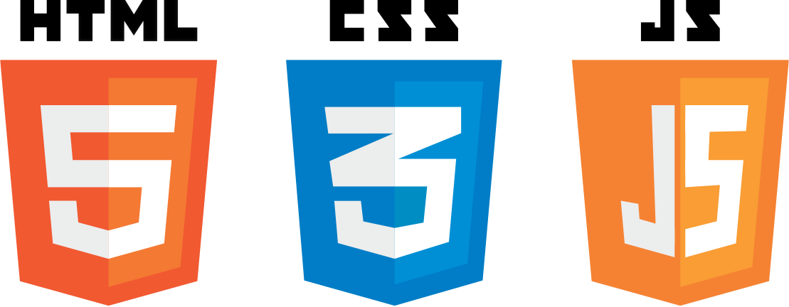

# AA.

**AA. é o título para meu portfólio pessoal, onde apresento alguns dos meus projetos github, bem como meu currículo e habilidades técnicas.**

  
## Linguagens

  

  
## Tecnologias

  

  

  
## Habilidades Praticadas

- Construção e Consumo de API com Json
- Responsabilidade com Mobile First
- Conceitos de UI e UX

  
## Screenshot

      

  
## Disponibilidade

Esta página está disponível no GitHub Pages. 

Para acessar, <a href = "#">clique aqui</a>.

  
## Autoria

Abner Andrade Graduando em Análise e Desenvolvimento de Sistemas, apaixonado por desenvolvimento e eterno aprendiz.

👋🏽 Curtiu? Entre em contato!

